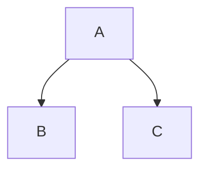
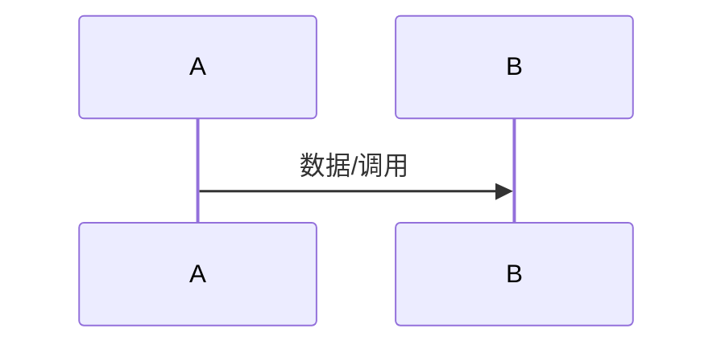

---
查阅条件：Step 3/5/6/7/8/9/15 生成各层文档或校验报告时查阅。
---

# 文档输出模板

本文件定义 codegen-docs 产出的各层文档的精确格式。每层模板采用「固定骨架 + 可选 Section」设计：
- **必选**：每个文档都必须包含
- **可选**：满足启用条件时包含，不满足时省略

---

## 地图层模板（MAP.md）

> 适用场景：新成员理解工程全局、跨模块修改时定位影响范围。

```markdown
# {工程名} 工程地图

## 工程概述
{一句话描述工程是什么、做什么}
{明确声明工程不做什么}

## 技术栈
| 类别 | 技术 |
|------|------|
| 语言 | {语言及版本} |
| 前端框架 | {框架名及版本} |
| 后端框架 | {框架名及版本} |
| 构建/包管理 | {工具名} |
| 数据库/存储 | {存储类型} |

## 架构风格
{描述整体架构风格：单体/微服务/monorepo/分层架构等}

## 工程类型分区
| 分区 | 路径 | 说明 |
|------|------|------|
| {前端/后端/混合} | {相对路径} | {分区说明} |

## 模块清单
| 模块名 | 职责简述 | 边界 | 源码路径 | 发现方式 |
|--------|----------|------|----------|----------|
| {名称} | {一句话} | {边界描述} | {相对路径} | {声明式/聚类/目录推断} |

## 模块依赖关系
{使用 Mermaid 有向图表示模块间依赖}


## 关键约束
- 部署环境：{描述}
- 性能基线：{描述}
- 合规要求：{描述}

---
_生成时间：{timestamp} | Git Commit：{hash}_
```

---

## 领域层模板（docs/{类型分区}/domain/{模块名}.md）

> 适用场景：维护该模块的开发者理解模块内部结构；跨模块修改时评估影响。

### 必选 Sections

```markdown
# {模块名}

## 职责与边界
**负责**：{列出这个模块负责什么}
**不负责**：{列出明确不属于本模块的职责}
**边界**：{与其他模块的分界线}

## 接口与契约

### 对外暴露的接口
{API 端点 / 函数签名 / 事件}
| 接口 | 类型 | 签名 | 说明 |
|------|------|------|------|

### 对外暴露的数据结构
{类型定义 / DTO / Schema}
| 数据结构 | 类型 | 用途 |
|----------|------|------|

## 模块依赖
| 依赖模块 | 依赖原因 |
|----------|----------|

## 源码锚点
- [→ {路径/文件}:{行号范围}] {职责描述}
- [→ {路径/文件}:{行号范围}] {职责描述}
```

### 可选 Sections

```markdown
## 数据模型
> 启用条件：模块包含持久化数据结构或核心领域对象

{数据模型定义，字段说明}
| 字段 | 类型 | 约束 | 说明 |
|------|------|------|------|

{模型间关系：一对多/多对多等}

## 业务规则与不变量
> 启用条件：模块包含业务逻辑或状态约束

{规则列表}
- RULE-{编号}：{规则描述}
  - 不变量：{什么条件必须始终成立}
  - 实现位置：[→ {路径}:{行号}]

## 状态机
> 启用条件：模块包含明确的状态流转

{状态定义}
| 状态 | 含义 | 可转换到 |
|------|------|----------|

{状态转换图：Mermaid stateDiagram}

## 设计意图
> 启用条件：模块的设计决策需要解释"为什么这样做"

{设计决策及原因}
- 决策：{做了什么决策}
- 原因：{为什么这样做}
- 取舍：{考虑过哪些替代方案}
```

---

## 横切层模板（docs/{类型分区}/crosscut/{关注点名}.md）

> 适用场景：跨模块修改时理解横切影响；新增功能时确认需要适配哪些横切关注点。

```markdown
# {横切关注点名}

## 涉及模块
| 模块 | 影响方式 |
|------|----------|

## 实现方式
{如何实现的，涉及哪些文件}
{框架/库的使用方式}

## 配置与约定
| 配置项 | 默认值 | 说明 |
|--------|--------|------|

## 源码锚点
- [→ {路径/文件}:{行号范围}] {描述}
```

---

## 流程层模板（docs/{类型分区}/flows/{流程名}.md）

> 适用场景：理解端到端数据如何流经系统；排查问题时追踪完整链路。

```markdown
# {流程名}

## 流程概述
{一句话描述这个流程做什么}

## 触发入口
| 入口 | 类型 | 触发条件 |
|------|------|----------|

## 模块序列
{数据流经的模块，按顺序列出，使用 Mermaid sequenceDiagram}


## 数据转换规则
| 节点 | 输入 | 转换逻辑 | 输出 |
|------|------|----------|------|

## 状态变迁链
{如有状态变化，描述状态如何流转}

## 源码锚点
- [→ {路径/文件}:{行号范围}] {描述}
```

---

## 索引文件 Schema（docs/{类型分区}/INDEX.yaml）

```yaml
version: "1.0"
generated_at: "{ISO 8601 timestamp}"
git_commit: "{40-char hash}"

modules:
  - name: "{模块名}"
    domain_doc: "domain/{模块名}.md"  # 相对于 INDEX.yaml 所在目录
    source_paths:
      - "{源码相对路径}"
    contracts:
      - type: "api"  # api | event | data
        name: "{契约名}"
        doc_section: "#{对应文档中的标题锚点}"

crosscuts:
  - name: "{关注点名}"
    doc: "crosscut/{关注点名}.md"
    affected_modules:
      - "{模块名}"

flows:
  - name: "{流程名}"
    doc: "flows/{流程名}.md"
    entry_point: "{入口描述}"
    involved_modules:
      - "{模块名}"

metadata:
  tech_stack:
    frontend: "{框架名或 null}"
    backend: "{框架名或 null}"
  project_type: "{monorepo | single | multi-module}"
```

---

## 首次生成校验报告模板（docs/validation/{日期}-generate.md）

```markdown
# 校验报告 — 首次生成

_生成时间：{timestamp} | Git Commit：{hash}_

## 校验概况
| 指标 | 值 |
|------|-----|
| 工程类型分区 | {分区列表} |
| 识别模块数 | {数量} |
| 生成文档数 | {数量} |
| 校验结果 | {通过/存在问题} |

## 结构性检查

### 地图层
- [x] / [ ] 工程概述完整
- [x] / [ ] 技术栈信息完整
- [x] / [ ] 模块清单完整（含发现方式标注）
- [x] / [ ] 依赖关系完整
- [x] / [ ] 关键约束完整

### 领域层
| 模块 | 必选 Section 齐全 | 源码锚点有效 | 备注 |
|------|-------------------|-------------|------|

### 横切层
| 关注点 | Section 齐全 | 源码锚点有效 | 备注 |
|--------|-------------|-------------|------|

### 流程层
| 流程 | Section 齐全 | 源码锚点有效 | 备注 |
|------|-------------|-------------|------|

## 索引文件检查
- [x] / [ ] 索引文件与实际文档一一对应
- [x] / [ ] 源码路径映射完整

## 问题清单
{列出所有检查不通过的项目，每项含：文件路径、问题描述、建议修复方式}
```

---

## 更新校验报告模板（docs/validation/{日期}-update.md）

```markdown
# 校验报告 — 文档更新

_生成时间：{timestamp} | Git Commit：{hash} | 基线 Commit：{baseline_hash}_

## 变更摘要
| 指标 | 值 |
|------|-----|
| 变更文件数 | {数量} |
| 受影响模块 | {模块列表} |
| 受影响横切关注点 | {关注点列表或 无} |
| 受影响流程 | {流程列表或 无} |

## 校验 A（代码 ↔ 设计方案）
{如未执行设计方案校验，标注：未执行（未找到设计方案文件）}

### 已落实
{设计方案中的变更点在代码中已实现的，逐条列出}

### 遗漏
{设计方案中有但代码未实现的}

### 超范围
{代码中存在但设计方案未涉及的}

## 校验 B（代码 ↔ 文档）

### 接口签名检查
| 模块 | 接口 | 文档描述 | 代码实际 | 一致 |
|------|------|---------|---------|------|

### 数据模型检查
| 模块 | 模型 | 文档字段 | 代码字段 | 一致 |
|------|------|---------|---------|------|

### 模块依赖检查
| 模块 | 文档依赖 | 代码 import | 一致 |
|------|---------|-------------|------|

### 依赖模块引用检查
{对受影响模块的依赖方，检查其文档中对本模块的引用是否仍准确}

## 已更新文档清单
| 文档路径 | 更新类型 | 更新内容摘要 |
|----------|---------|-------------|

## 待确认项
{标注为「待确认」的不一致处，每项含：文件路径、section、具体描述}
```
